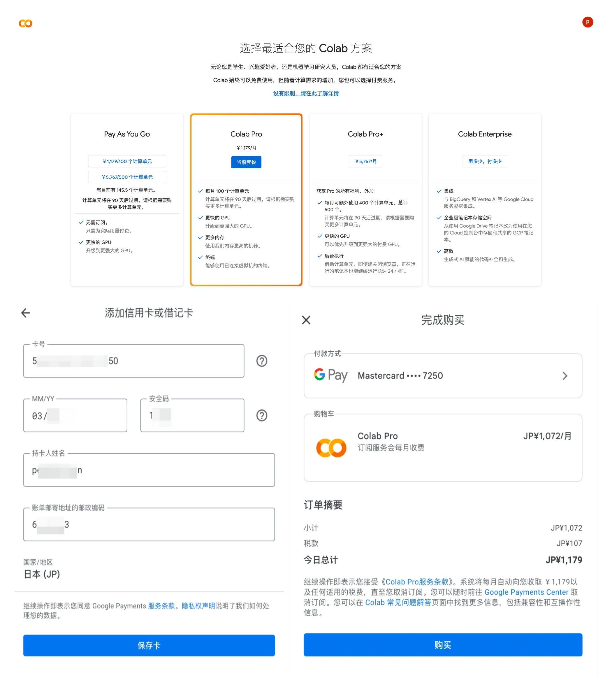
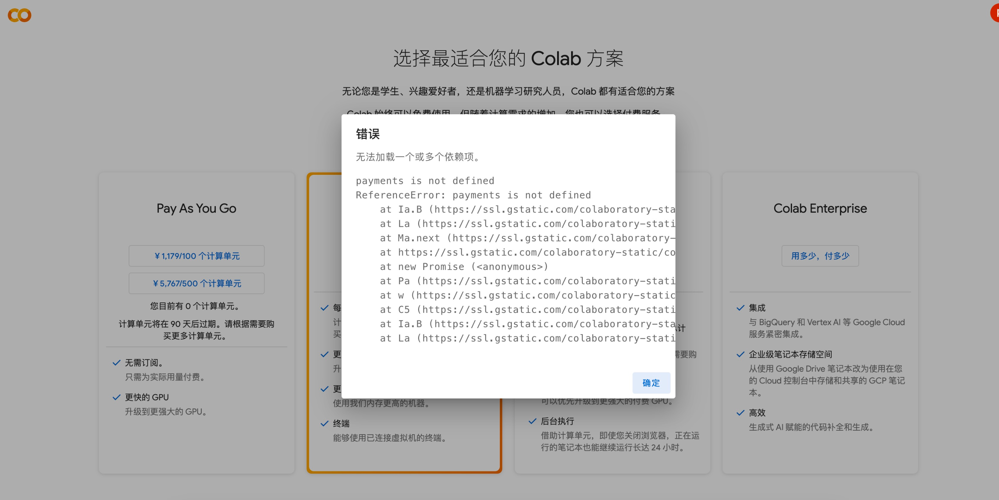

# Colab使用过程中常见问题答疑

- [Colab使用过程中常见问题答疑](#colab使用过程中常见问题答疑)
  - [Colab中GPU的显存是否能扩展:](#colab中gpu的显存是否能扩展)
  - [如何订阅 Colab Pro:](#如何订阅-colab-pro)


## Colab中GPU的显存是否能扩展:

答: Colab中GPU的显存不能拓展。以T4显卡为例，免费版本T4显存大小为12G，订阅 Colab Pro 后只是多了个 **高 RAM** 模式，显示显存达到了15G。但这不是真正的显存拓展‼️‼️

读者尝试下就知道了，假设你的显存占用在 12G～15G 之间，模型加载时会被提示 "部分参数没有加载到显存上" ，即部分参数加载到了RAM，模型无法正常推理🚨

订阅 Colab Pro 后多的是显卡选项，例如增加了 A100、TPU。A100的显存大小固定为40G，同样不能拓展，例如扩展到80G。购买 **计算单元** 也无法拓展显存大小，只会增加你GPU的使用时长。


## 如何订阅 Colab Pro:

1. 选择合适的套餐。
2. 填写卡片信息(VISA卡或其他银联卡都可)，然后付款。

操作如图:



> [!TIP]
> 可以多更换几个节点查看价格，不同节点的价格不同。美国标准价格为 $9.9/month 。

如果订阅 Colab Pro 时付款界面一直出错，错误信息如下:

```log
错误

无法加载一个或多个依赖项

payments is not defined
ReferenceError: payments is not defined
  at Ia.B (https://ssl.g...)
```

这是科学上网的问题，更换节点或重启VPN可以解决。笔者在没有更换节点前遇到的界面如下:

