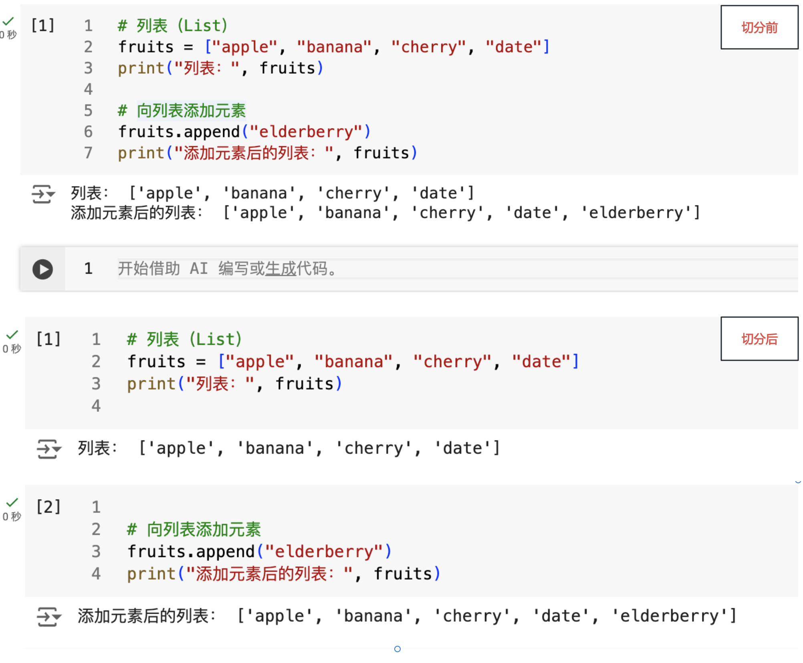

# 快捷指令

- [快捷指令](#快捷指令)
  - [代码块转文本块](#代码块转文本块)
  - [文本块转代码块](#文本块转代码块)
  - [在当前代码块下方插入一个代码块:](#在当前代码块下方插入一个代码块)
  - [在光标处切分代码块](#在光标处切分代码块)

## 代码块转文本块

1. 确保你当前选择的代码块。
2. 按Esc退出编辑模式。
3. 使用快捷键：`Command + M` 然后按 `M`（即先按住 `Command` 和 `M`，然后松开后再按一次 `M`）。

## 文本块转代码块

1. 选中你要转换的文本块(不是编辑模式)。
2. 按下 `Command + M` 然后再按 `Y`，就可以将文本块转换为代码块。

## 在当前代码块下方插入一个代码块:

1. 选择单元格。
2. `Command + M` 然后按 `B` 来快速插入一个新的代码块。

## 在光标处切分代码块

在光标处切分代码块，即: 将代码块从光标处一分为二。

1. 将光标置于对应位置。
2. `Command + M` 然后按 `-` 来切分代码块。(切分后会添加额外的空行，需要自己处理)

